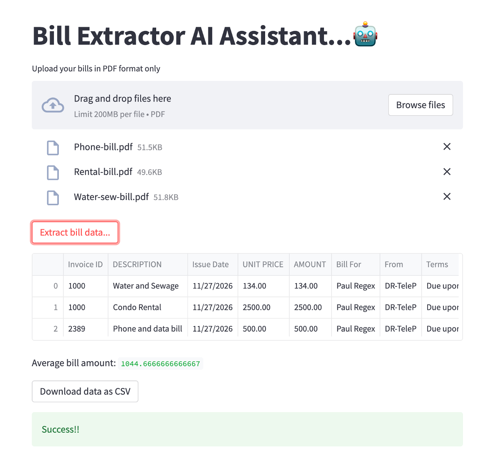

# llm-pdf-extractor
This project demonstrates the use of llm for extracting and analyzing data from PDFs.
[

Setup new python environment.
python3 -m venv pdfenv
cd pdfenv
source bin/activate

pip install langchain
	pip install openai
	pip install python_dotenv

	If you get Error something like 
	"pydantic.errors.PydanticUserError: If you use `@root_validator` with pre=False (the default) you MUST specify `skip_on_failure=True`. Note that `@root_validator` is deprecated and should be replaced with `@model_validator`.		"

	pip install pydantic==1.10.9
	pip install streamlit
	pip install pands, regex, pypdf

	If you get an error starting streamlit that says, (on MacOS)
INTEL MKL ERROR: dlopen(/Users/jay/opt/anaconda3/lib/libmkl_core.1.dylib, 9): image not found.

	conda install -c anaconda mkl
.

